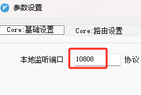
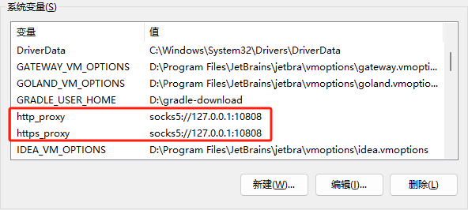

找到代理软件的端口，这里以v2rayN为例：


# 配置CMD
## 临时生效
```shell
# 使用sock5代理
set http_proxy=socks5://127.0.0.1:10808
set https_proxy=socks5://127.0.0.1:10808
```
如果要取消：
```shell
set http_proxy=
set https_proxy=
```
## 长期生效
编辑环境变量，添加：

