# 一、软件构成

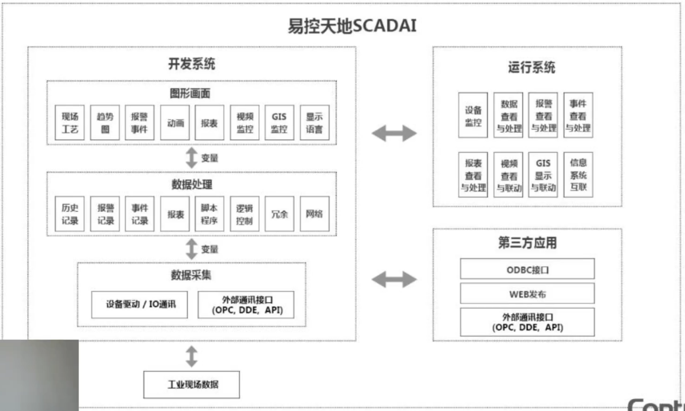

# 二、工程管理

## 1、新建项目

点击【新建项目】按钮，输入项目名称，选择位置。

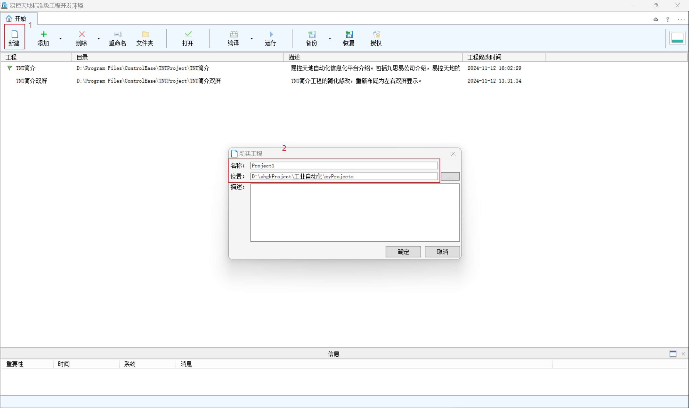

## 2、添加项目

把已有的项目添加到易控天地中，点击【添加】按钮，选择项目所在路径。

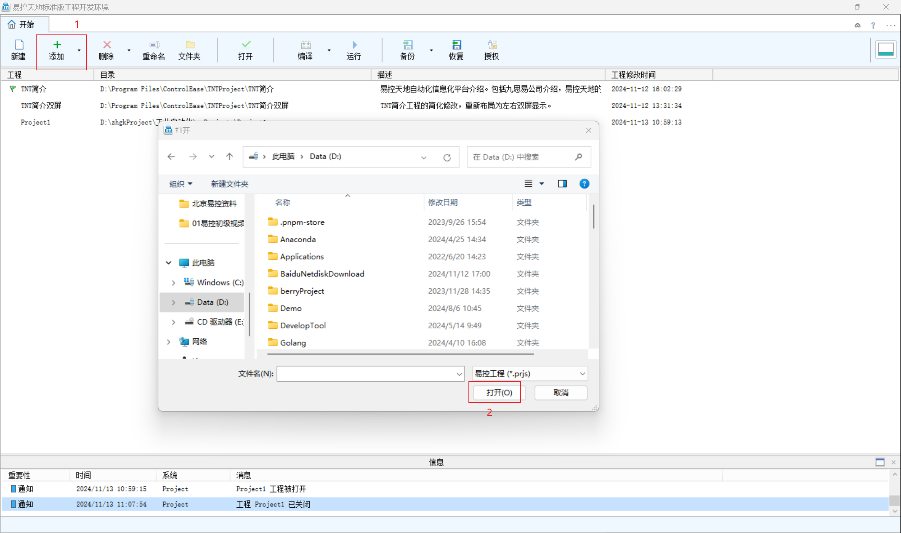

## 3、删除项目

选择项目，点击【删除】按钮，可以只删除项目或者从磁盘删除。

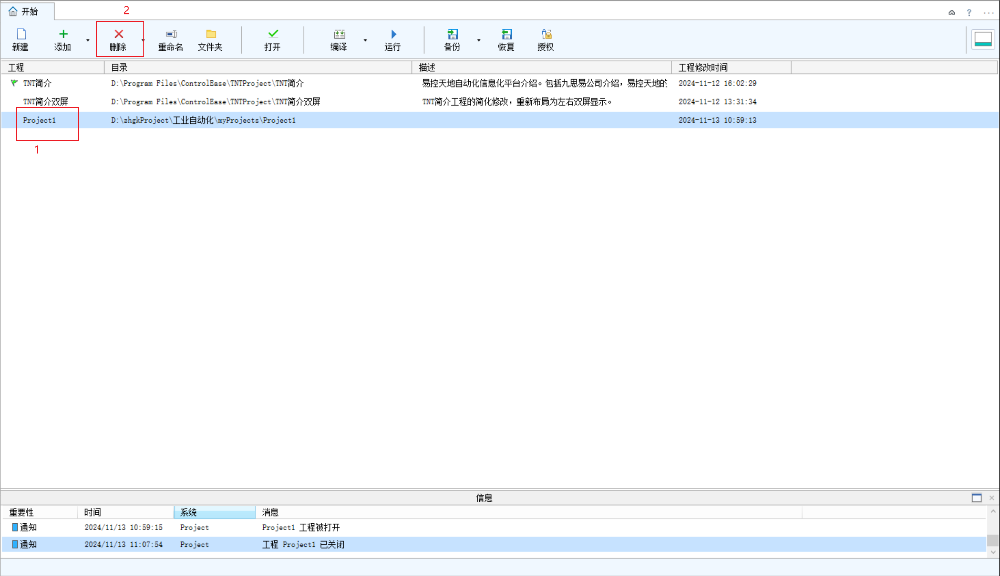

## 4、重命名项目

选择项目，点击【重命名】按钮，输入新的项目名称。

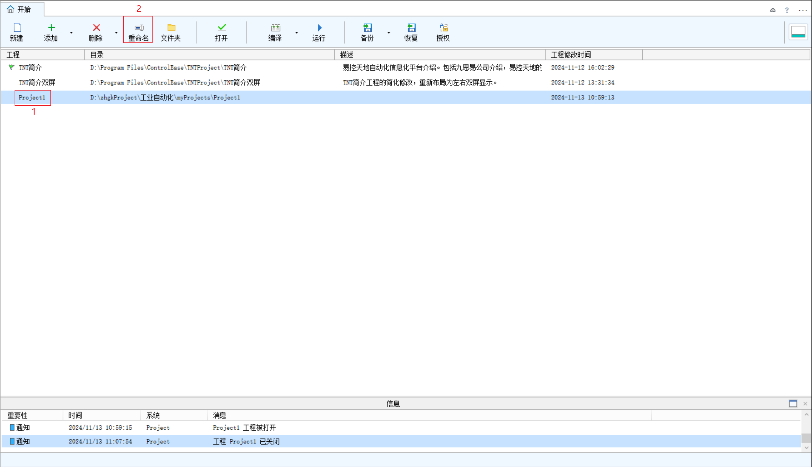

## 5、编译项目

选择项目，点击【编译】按钮，编译项目，检查是否有报错。

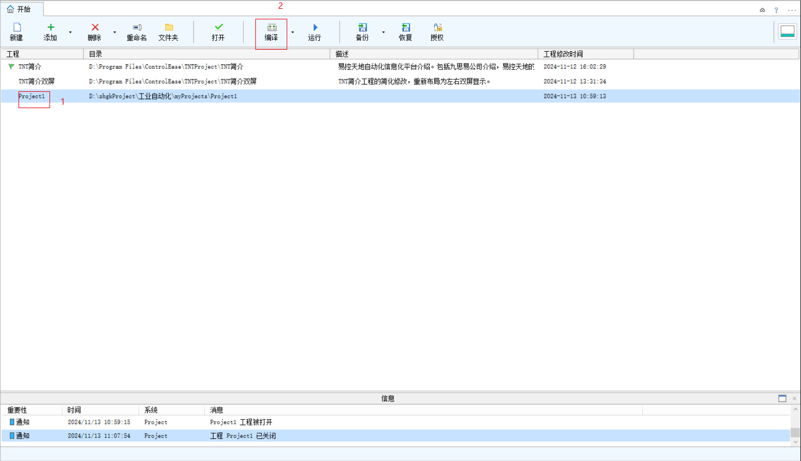

## 6、运行项目

选择项目，点击【运行】按钮，运行项目。

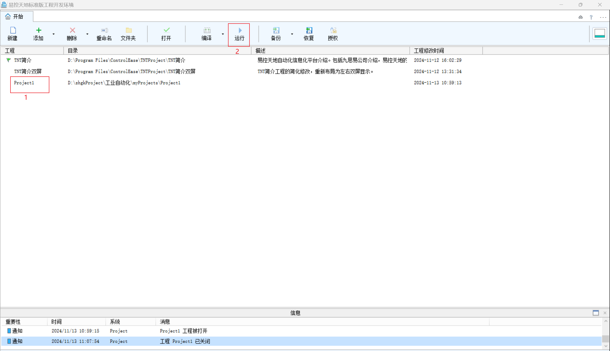

## 7、备份项目

选择项目，点击【备份】按钮，备份项目。

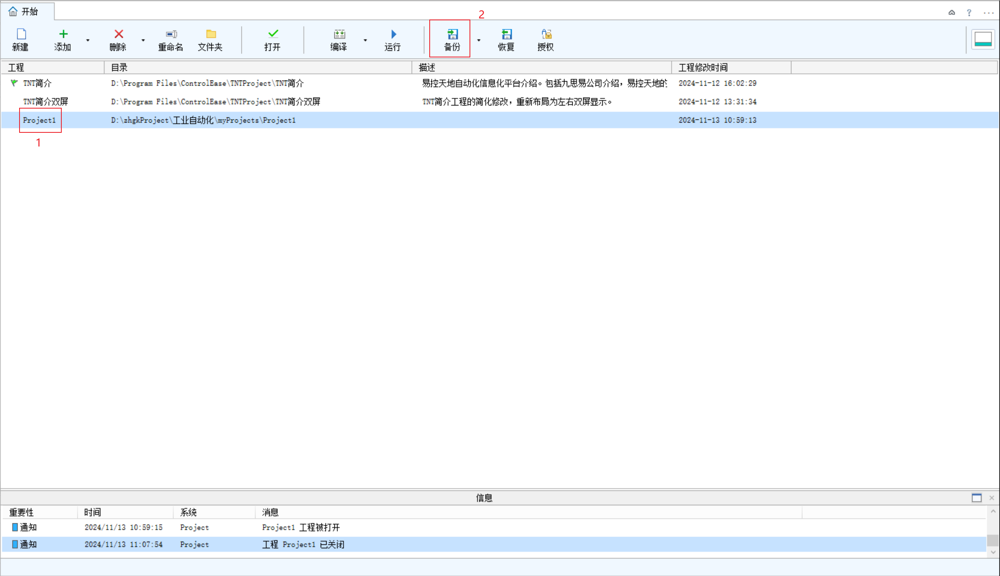

## 8、恢复项目

点击【恢复】按钮，选择文件路径，恢复项目。

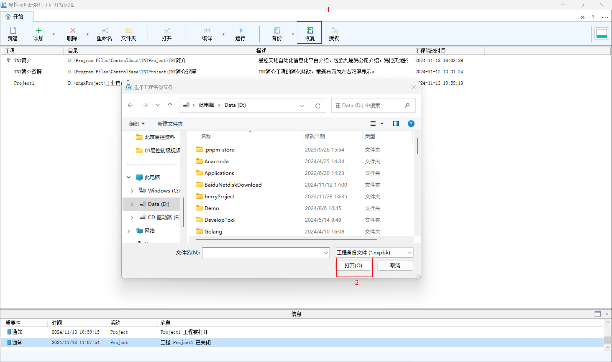

## 9、部署项目

- 把工程文件拷贝到电脑，打开，编译、运行。
- 生成安装包（exe文件），安装到服务器。

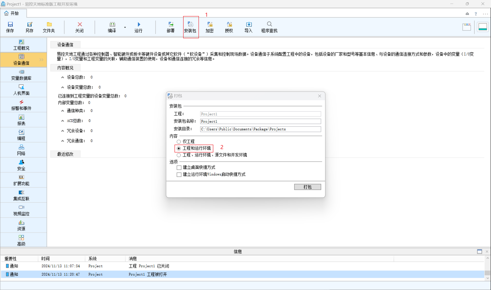

- 部署的方式，开发电脑和服务器在同一个网络，把项目文件部署到服务器（服务器安装接收服务软件）。

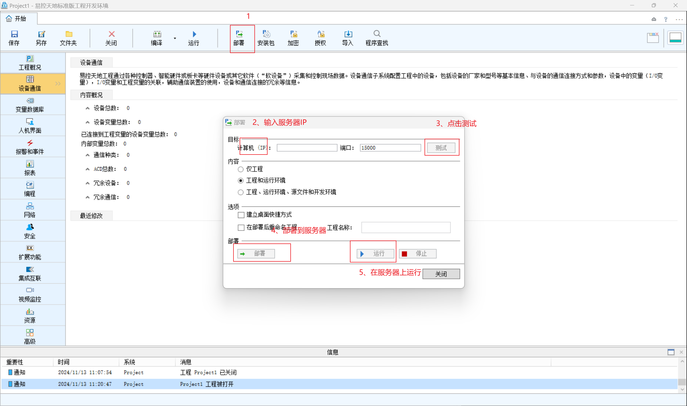

# 三、工程开发顺序

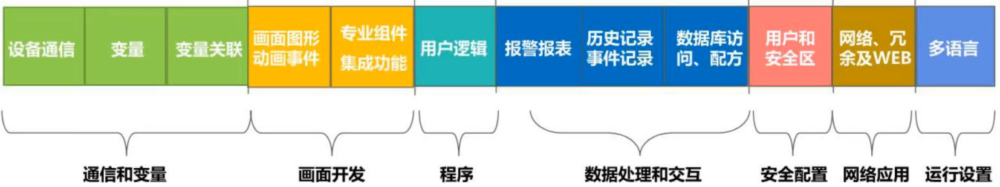

# 四、设备通讯

## 1、设备通信概念和用途

**概念**：设备通信是指实现监控及信息管理系统与被监控的自动化设备(“下位机”)之间的数据交换。 

其中下位设备包括PLC、DCS、智能数据采集模块、板卡、变频器、伺服控制器、UPS、称重仪表、 LED显示屏、智能仪器仪表、无线远程数据终端、甚至其它计算机系统等各种各样具有数据通信
接口和通信协议的硬件设备。

**用途**：及时准确地采集和控制现场数据。 
开发人员不需要了解现场的通信介质、通信接口、通信协议等就能够快速建立与设备的连接。

**用户最为关心的问题**:

- 数据采集的速度、稳定性
- 是否属于已支持的设备
- 新设备驱动开发是否快速

## 2、易控设备通信特点和相关名词

**特点**

- 支持众多设备
    - 内置数干种设备通信程序，支持各行业专业协议和各种国际标准协议，支持特殊协议快速开发用户可自开发。
- 通讯速度快
    - 支持结构体，内置打包机制，支持毫秒级高速采集。
- 通讯稳定可靠
    - 支持通信测试，支持故障恢复策略，支持动态启停，支持冗余。
- 易用
    - 图形化配置，内置网关轻松实现不同设备间数据交换。
       

**相关名词**

| 名词   | 含义                                                                           | 举例                                             |
|------|------------------------------------------------------------------------------|------------------------------------------------|
| 设备   | 在现场进行数据采集的硬件产品称为“设备”。是易控天地通信的对象。设备按照设备类型、通信接口类型、生产厂家等分类。                     | PLC、智能仪表、变频器 OPC设备、板卡等                         |
| 通道   | 设备的硬件接口称为“通道”。是易控和仪器、仪表、PLC等外部设备进行信息交换的“走廊”或者“媒介”                            | 串口、以太网、OPC通道等。                                 |
| 驱动程序 | 针对不同类型、厂家和型号的设备，按照设备的特定通信协议编写的程序，实现易控软件和设备之间数据通信能力的软件模块。                     | 西门子S7400以太网驱动程序                                |
| 设备变量 | 与现场设备寄存器对应的变量，也称为“IO变量”。                                                     | 单元格12                                          |
| 虚拟设备 | 物理上并不存在的假想硬件，工作过程和真实设备没有区别，主要用于测试及获取一些需要按照规律变化的信号                            | ControleaseSimulator提供寄存器类型 Increase、Decrease等 |
| 设备网关 | 易控独有的概念，软件设备网关，无需硬件，通过简单配置实现两个不同设备间的高效数据交换。 |                                                |
| 设备冗余 | 当某一硬件发生故障时，冗余配置的硬件可以及时介入并承担故障硬件的工作，由此减少由于硬件故障带来的损失。                          |                                                |

## 3、建立一个设备通信、使用仿真设备

### 3.1、打开项目，双击【设备通信】

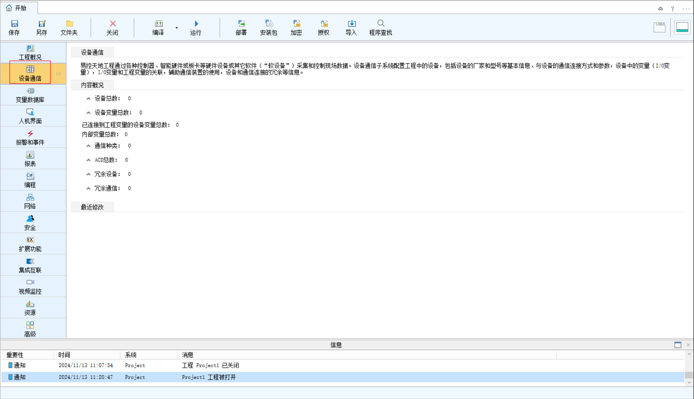

### 3.2、双击 【Omron Fins Ethernet】，输入相关信息

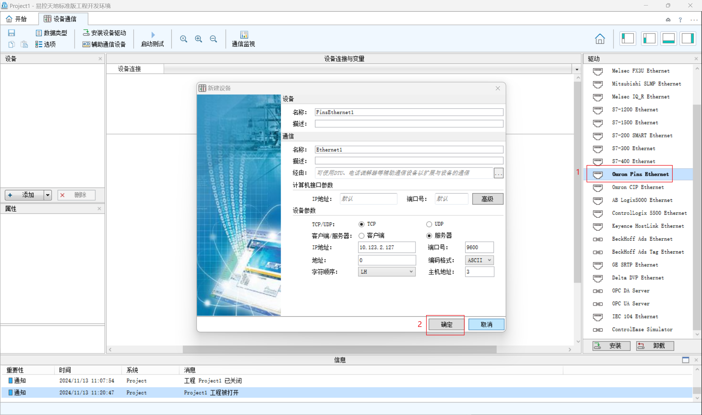

### 3.3、设备属性解释

- 计算机接口参数：修改计算机的IP地址、端口号。
- 设备参数：修改设备的IP、协议等信息。
- 模式：
  - Synchronous（同步）：适用在数据量大，通讯效率要求高，一般监控系统都使用此模式。
  - Asynchronous（异步）：效率比较低，特殊情况使用。
  - Auto（自动）
- 延时：针对Asynchronous（异步）模式，Synchronous（同步）模式不用管。
- 通信超时：设备反馈的最长时间。
- 通讯状态：关联内部变量，通过对变量的监控可以知道设备的状态，把变量放在画面或者控制逻辑程序里，根据变量的值来判断设备是否正常。
- 是否启用：关联变量，通过此变量控制设备是否启用。例如：设备坏了，系统还在对该设备发送协议，会消耗资源，可以通过此变量停止启用设备。
- 错误处理：点击【选项】、【错误处理】，设置设备通讯失败后的处理方式。
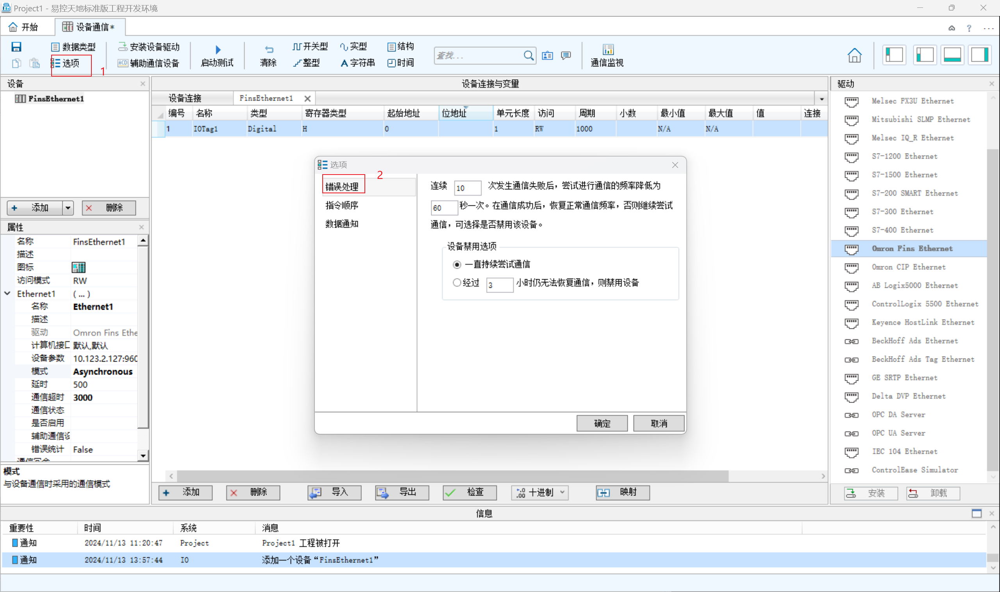
- 辅助通讯设备：设备无法采用网线通讯，可以新增无线通讯。
- 通讯冗余：一个设备可能有多个网口。
- 设备冗余：主设备和从设备，防止设备宕机。

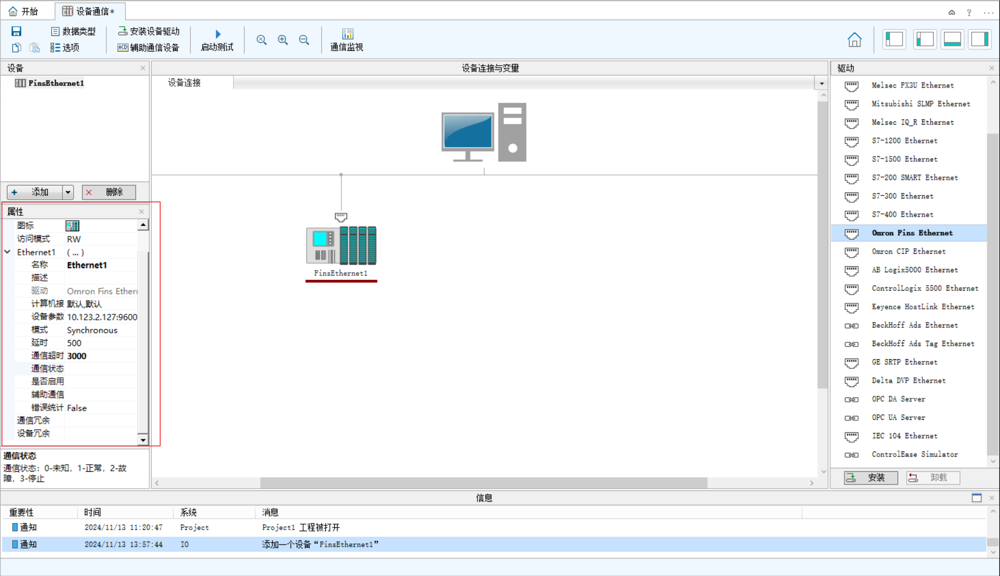

### 3.4、设备变量解释

双击设备，添加变量。

特别注意，位地址只有Digital（开关量）类型使用，不使用置为空。

单元长度：不是一个位或者一个字节的概念，由设备、变量类型、寄存器类型来决定的。例如：类型为Digital、寄存器类型为D，单元长度位1代表一个位。整数类型为Integer，在西门子的某些设备则为一个字节，欧盟的以太网设备代表一个16位的整数。常规下，1代表16位的整数。

访问类型：RW（读写），R（读），W（写）。

周期：采集周期，根据现场设备设置

小数：小数位数

值：点击【启动测试】按钮，可以看到采集的数据。

连接：变量和变量数据库关联

【导入】【导出】最好使用office，wps会改变cvs文件格式。

检查：检查变量配置是否正确

进制：编写变量地址时使用，根据具体情况，选择进制。

映射：变量关联变量数据库里的值（如果变量数据库不存在，则直接创建并关联。）

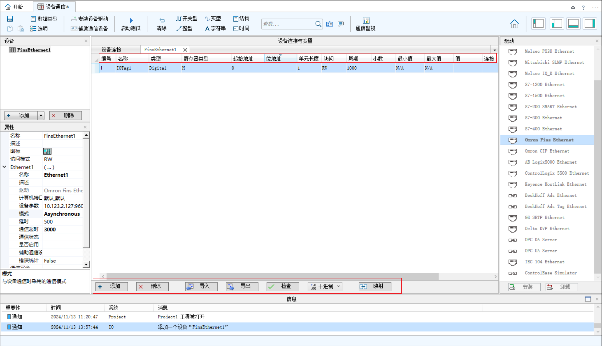

### 3.5、新建虚拟仿真设备
双击【ControlEase Simulator】，填写相关信息。

## 4、驱动程序安装和管理

点击【安装】按钮，选择驱动安装包。

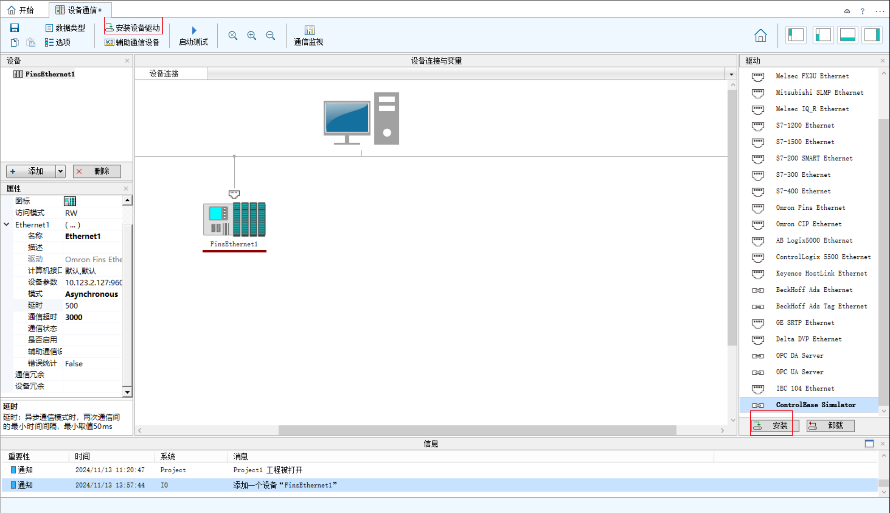

如果这样加载不出来，打开驱动管理工具（以管理员身份运行），选择驱动安装包进行安装。

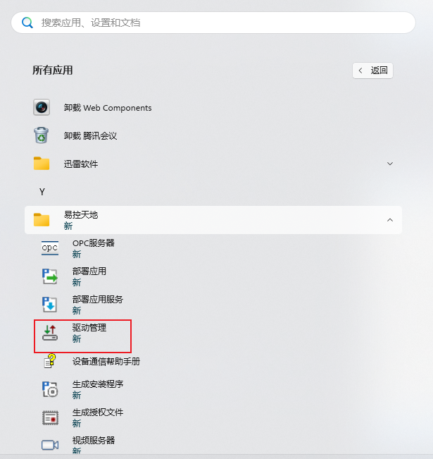

## 4、工程设计提示
- 进行工程开发前，要了解整个监控系统的通信方式，根据现场和设备的需要选择合适的设备驱动方式，既可以提高通信速率又可以节省成本。
- 在使用易控建立设备通信前，先使用第三方通信软件进行测试，如厂家自己的调试软件或串口调试工具等。
- 设备与易控软件在进行通信的过程中往往需要设置一些通信的参数，如串口号、波特率等，在易控的通信驱动帮助文档中对于这些参数的设置都有介绍。按照系统点表建寄存器，注意某些设备（如Modbusi设备)有地址偏移。
- 重视通信的某些参数：查询周期、通信超时、通信延时和通信出错控制，更改这些参数有时可以显著改善通信质量。
- 在易控软件和设备通讯有问题时，通过日志查看是否有相关的错误提示，根据提示修改相关的配置等。
- 易控软件按设备变量个数和工程变量个数进行收费，购买软件前就需要对设备变量进行合理规划。

# 五、变量
## 1、变量概念和用途
- 大量变化的数据是自动化系统的核心，SCADA软件中将这些数据称为“变量"
- 易控天地管理的变量数值有来自设备的变量(“IO变量”)，也有来自或用于工程中各种逻辑处理中间结果的变量(“内部变量”)。它既管理变量的当前数据，也记录变量数据的历史变化过程，并提供数据查询服务。
- SCADA软件一般都可以将变量进行分组管理。
- 变量管理功能有变量引用、统计、替换等。

易控天地实时数据是基于内存管理的，执行效率高。历史数据的记录采用了多项数据缓冲处理技术，能满足大吞吐量数据的需要，数据查询效率高。历史数据的存储则采用了标准SQL数据库、mysql数据库，数据的记录十分稳定可靠。

## 2、易控变量管理特点和相关名词
- 更强的数据管理能力，适应更大规模和更复杂的应用，单机支持十万点级别。
- 支持结构型和数组型变量，支持变量的网络服务和使用。
- 与现实吻合的按树形结构进行多级分组的数据管理方式。
- 变量的初始值数据的转换更加多样，支持计算型中间变量。
- 更有效的批量建立和编辑，变量替换和使用统计功能显著提升应用开发效率。

- 内部变量、外部变量及其关联
  - 外部变量：直接对应着所连接的设备中的数据，如PLC内的某个寄存器
  - 内部变量：与设备无直接关联，一般用于在计算或程序开发过程中进行中间转换
  - 两者关联：传统易控天地在建立工程变量的时候，需要事先指定哪些变量是内部变量哪些变量是外部变量，易控中需要指定这个变量和外部设备的寄存器关联时，通过一种“连接”关系，就可以随时建立这种关联
- 点数授权
  - 将内部变量包括进来的计算方法称为“虚点计算方法”（内部变量俗称“虚点”），只计算外部变量的计算方法称为“实点计算方法”（外部变量俗称“实点”）。易控天地对授权的计算采用实点+虚点计算方法
- 变量类型
  - 变量一般具有名称、类型、初始值、最大值、最小值、描述说明、是否保存初始值等属性
- 变量分组
  - 般按照变量的逻辑关系将变量进行分组管理，可以进行组的复制，提高效率，也方便查找
- 系统变量
  - 系统默认存在的变量：如系统时间，工程路径，用户名，定时器等特定功能变量
- 数组型和结构型变量
  - 复合型的数据类型,类型内可建立多个成员，数组类型中每个成员的数据类型一致，结构类型中每个成员可设置为不同的数据类型

## 3、变量管理
初始值
- 设定值：每次运行时，变量的设定值会重置为初始值。
- 保存值：调用保存值指令（参数为变量）。例如：参数报警上限设置为90，下次启动以90为初始值。
- 退出值：软件退出时的值作为下一次运行的初始值。设备断电为非正常退出，不会生效。

连接转换：根据比例转换，例如PLC中的值为100~1000，转换到工程上可以是10~100
- 开方
- 线性
- 值表
- 公式
  - 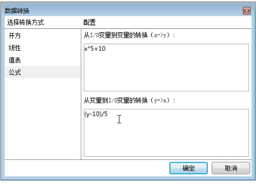

历史记录

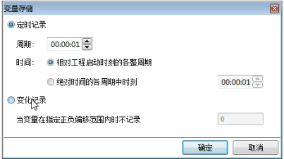

变量替换：工程内全局的变量替换

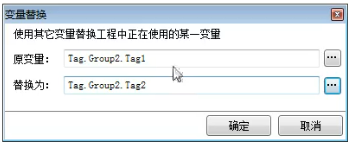

### 工程设计提示
- 变量组和变量的命名尽量简单明了，对于大量有规律的变量尽量建立在一个变量组中，便于统一修改时的方便。
- 为加快工程开发进度，设备变量和内部变量的定义可以分开进行，通过“导入”"功能合并到一个工程中。
- 很多设备是到现场才能确定或需要调整的（如PLC程序的变化），我们把设备变量和工程变量分开设计很主要的一个目的就是为了在这种情况下，不影响工程的开发。正确的工程设计是先配置和使用工程变量，然后连接工程变量和设备变量（寄存器）

